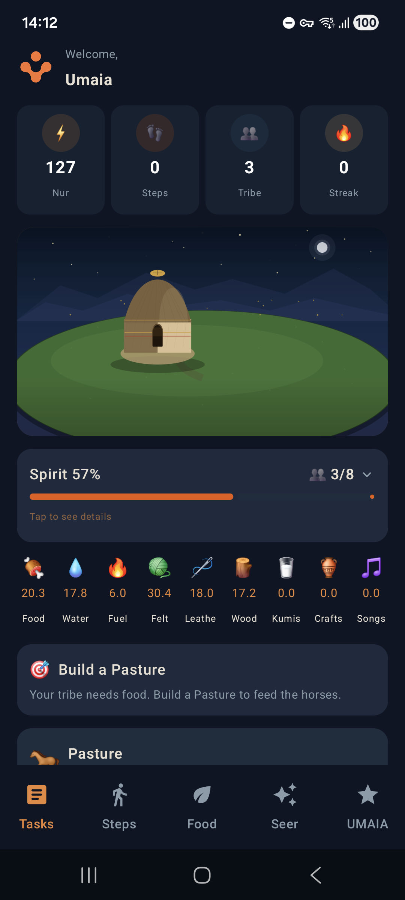
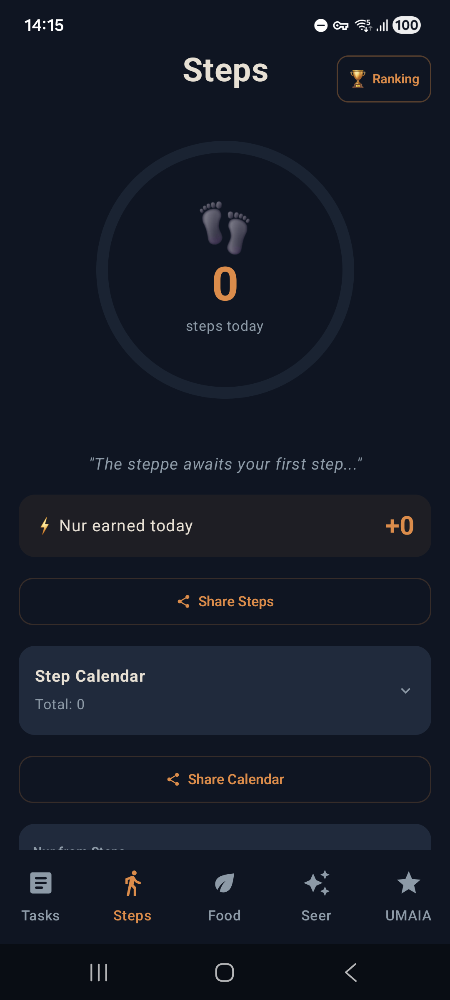
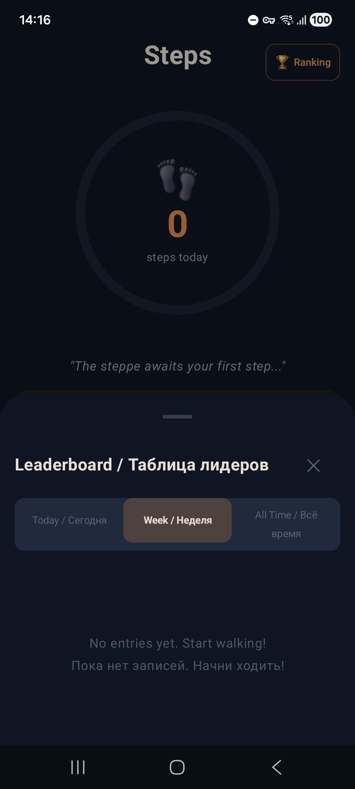

# Umaia — Android App

Walk. Build your nomad world. Discover your path.

**Umaia** is a step-tracking wellness game inspired by Kazakh mythology. Every step you take in the real world powers a living nomadic village — construct buildings, manage resources, compete on global leaderboards, and discover your tribal role through the Oracle.

   

## Features

- **Step tracking** — real-time sync via Google Fit API
- **Village builder** — construct yurts, pastures, workshops, and manage resources
- **Global leaderboards** — daily, weekly, and all-time rankings
- **Oracle questionnaire** — discover your tribal role (Warrior, Healer, Shaman, Guardian)
- **Nutrition module** — 30+ lessons rooted in nomadic wisdom
- **Multi-language support** — English, Russian, and Kazakh
- **Anti-cheat system** — GPS-validated step tracking

## Downloads

Get the latest APK from [GitHub Releases](https://github.com/vuvko-lab/umaia-android/releases).

## Building

### Requirements
- Java 17
- Android SDK 35
- minSdk 26 (Android 8.0+)

### Setup
```bash
git clone git@github.com:vuvko-lab/umaia-android.git
cd umaia-android
cp local.properties.template local.properties
# Fill in local.properties with your Supabase and Google OAuth credentials
```

### Build
```bash
# Debug APK
JAVA_HOME=/usr/lib/jvm/java-17-openjdk ./gradlew assembleDebug

# Release APK
JAVA_HOME=/usr/lib/jvm/java-17-openjdk ./gradlew assembleRelease

# Play Store AAB
JAVA_HOME=/usr/lib/jvm/java-17-openjdk ./gradlew bundleRelease
```

## Stack

- **Kotlin** + **Jetpack Compose**
- **Supabase** (PostgreSQL + PostgREST)
- **DataStore** + **Flow** for state management
- **Hilt** for dependency injection
- **Google Fit API** for step tracking

## License

Licensed under the **Apache License 2.0**. See [LICENSE](LICENSE) for details.

---

**Walk. Build. Thrive.**
